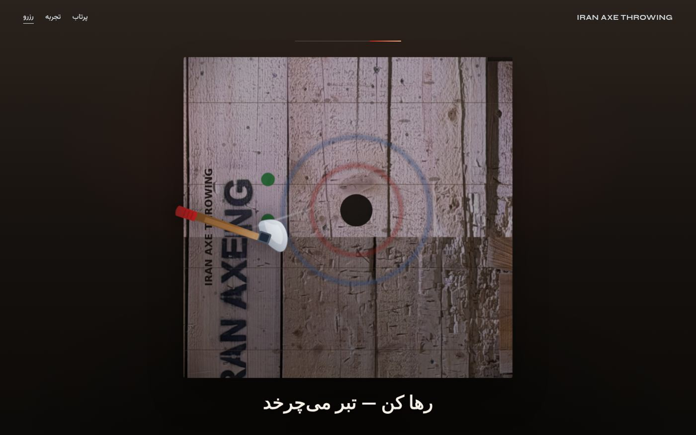
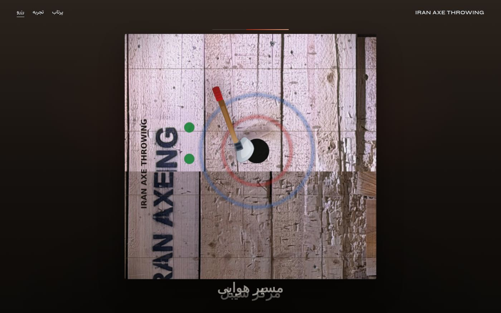
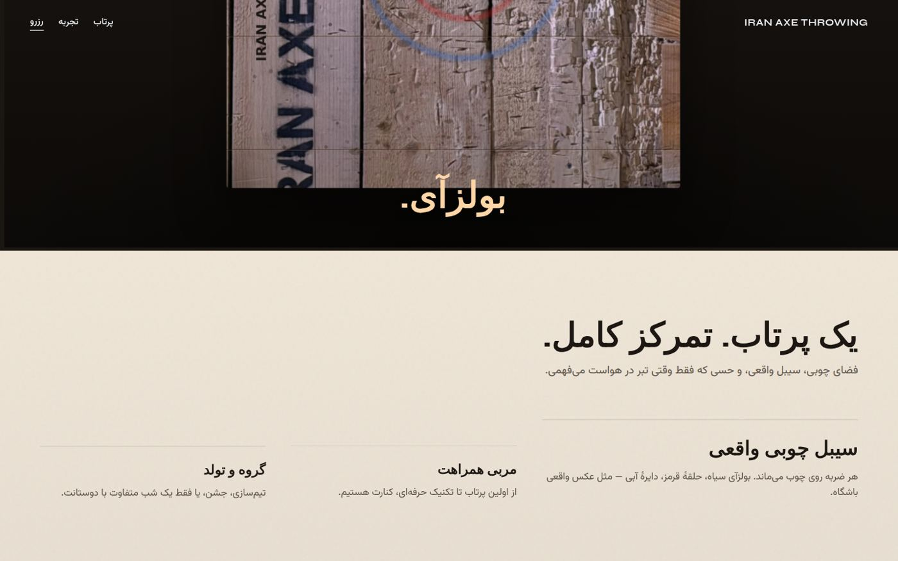
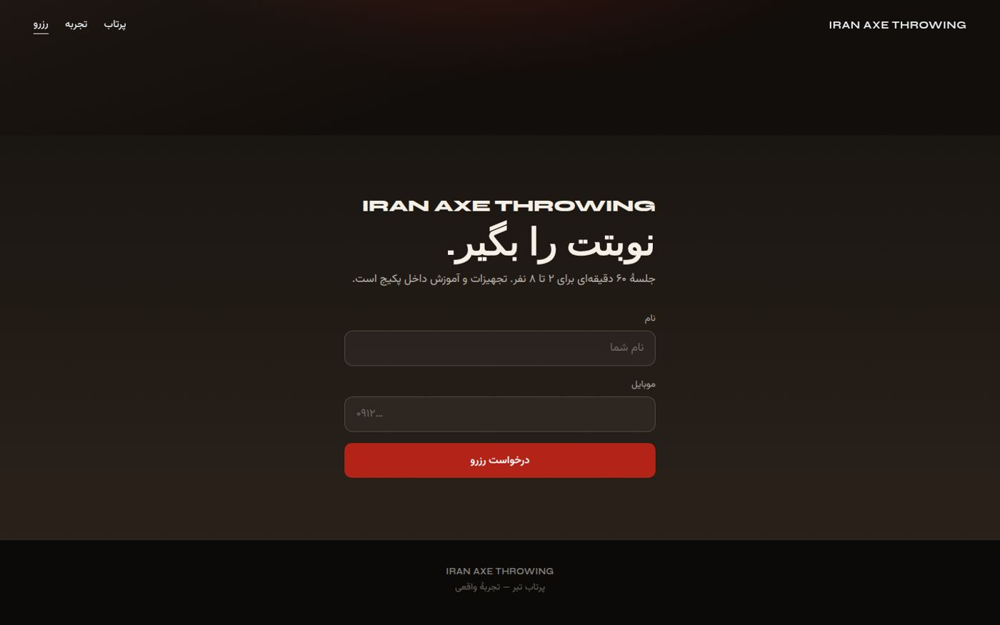
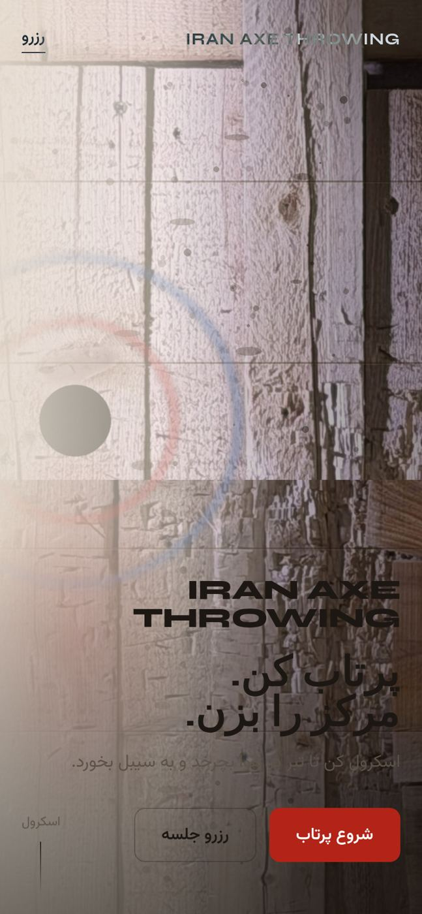

# Iran Axe Throwing

لندینگ اسکرول‌محور با حس صفحات محصول اپل — تبر با اسکرول می‌چرخد و به سیبل می‌خورد.

**Live repo:** https://github.com/moh3nfa/axe

## Preview

### Hero


### رها کن — تبر می‌چرخد


### مسیر هوایی


### بولزآی


### رزرو


### موبایل


## Run locally

```bash
python3 -m http.server 8765
# open http://127.0.0.1:8765
```

## Stack

- HTML / CSS / vanilla JS
- GSAP + ScrollTrigger (CDN)
- RTL Persian UI + English brand

## Structure

```
index.html
css/styles.css
js/app.js
assets/          # axe + target art
docs/screenshots # README previews
```
