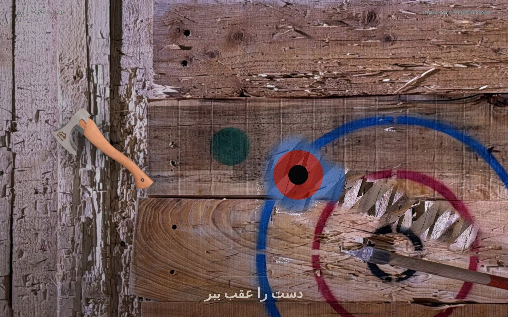
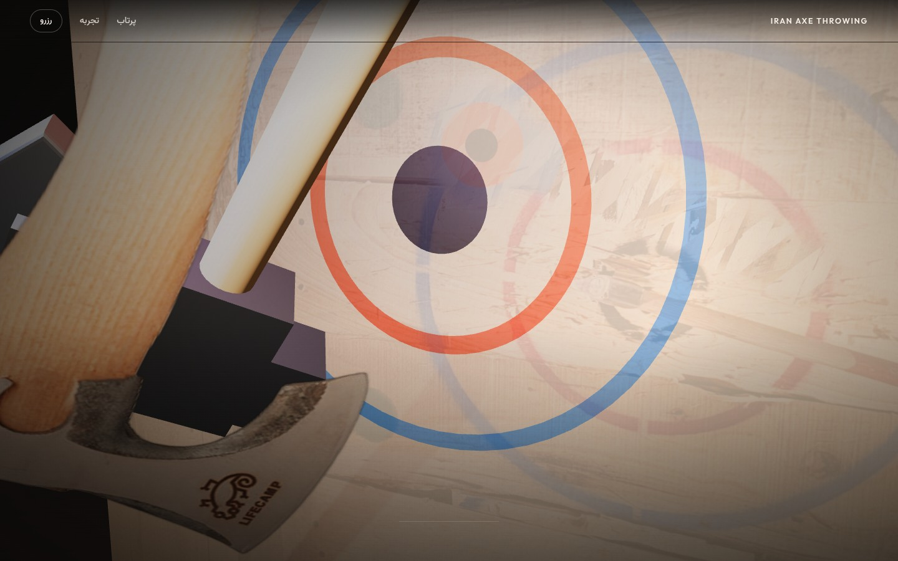
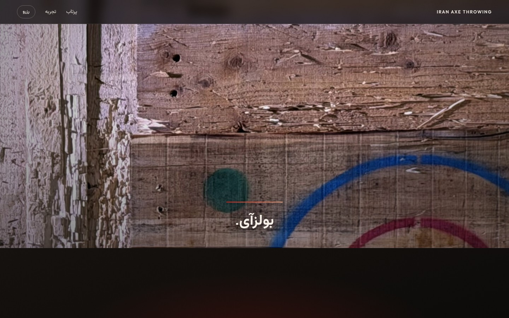
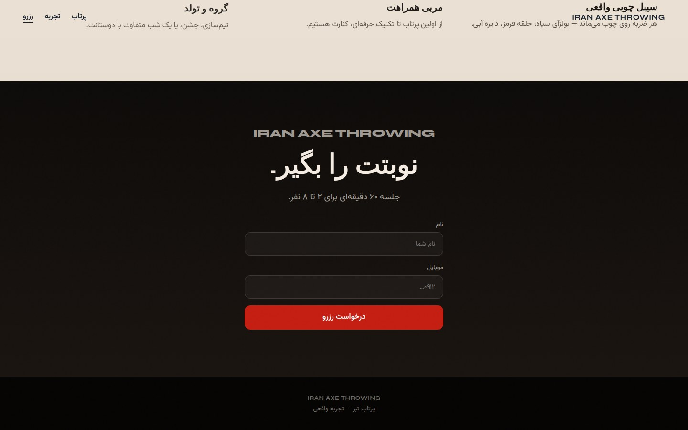

# Iran Axe Throwing

لندینگ اسکرول‌محور با **موتور سه‌بعدی Three.js** — دوربین مداری و پرواز تبر با اسکرول کنترل می‌شود.

**Repo:** https://github.com/moh3nfa/axe

## Preview

### Hero


### مدار دوربین / پرواز تبر


### برخورد


### رزرو


## Run

```bash
python3 -m http.server 8765
# http://127.0.0.1:8765
```

## Stack

- Three.js `0.170` (WebGL) — `js/engine.js`
- GSAP + ScrollTrigger — `js/app.js`
- HTML / CSS / vanilla ES modules
- RTL Persian + English brand

## Features

- Sticky full-viewport WebGL scene
- Scroll-driven camera orbit (yaw / pitch / FOV)
- Procedural 3D axe + LIFECAMP photo decal
- Cubic Bézier flight path + spin / tumble
- Target wall with painted rings + venue photo crossfade
- Impact flash and hit-photo blend
- Booking form
